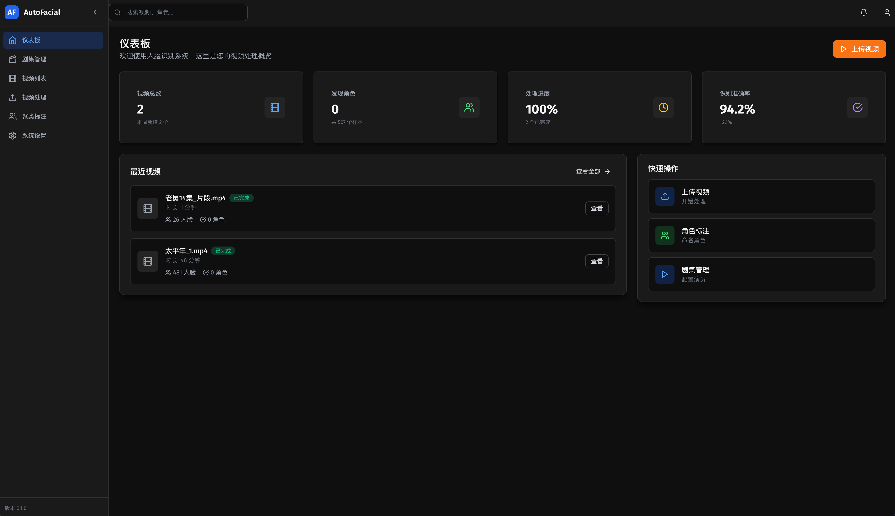
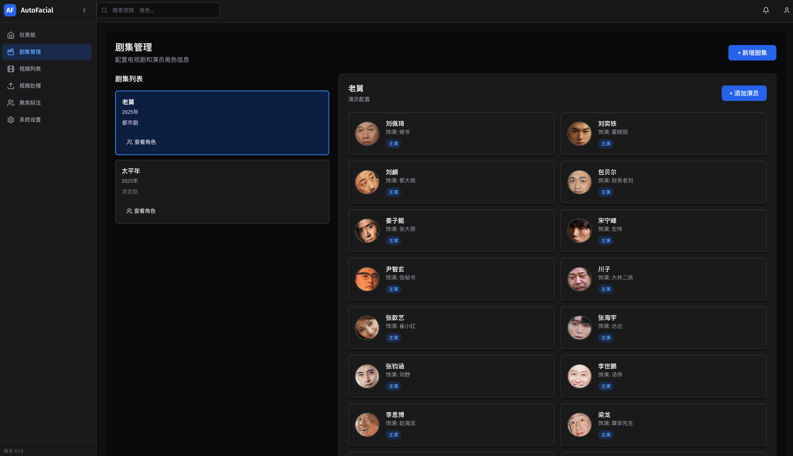
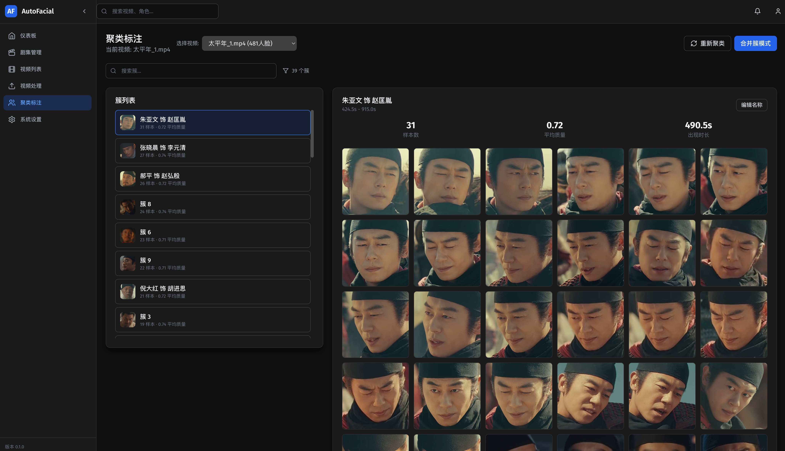

# AutoFacial

> 影视人脸识别自动化系统 — 自动从视频中提取人脸、聚类发现角色、匹配演员信息

[](https://www.python.org/)
[](https://fastapi.tiangolo.com/)
[](https://react.dev/)

## 为什么需要 AutoFacial？

在影视后期制作、内容分析中，人物识别是一个常见但耗时的工作。传统方式需要人工逐帧标注，效率低下且容易出错。

**AutoFacial** 通过深度学习和智能聚类算法，将这一过程自动化：

- **从零发现角色**：无需预先标注，系统自动从视频中识别出所有角色
- **演员关联**：将识别出的角色与真实演员信息匹配
- **批量处理**：支持多剧集、多视频的统一管理
- **可视化操作**：现代化 Web 界面，操作直观简单

### 应用场景

| 场景                   | 价值                                                         |
| ---------------------- | ------------------------------------------------------------ |
| **影视后期制作** | 自动生成角色集，减少人工标注工作量 90% 以上                  |
| **内容检索**     | 基于人物快速定位视频片段，支持「某角色在哪些场景出现」的查询 |
| **数据分析**     | 统计角色出场时长、频次，为剪辑和宣发提供数据支持             |
| **版权监控**     | 监控影视内容中特定人物的使用情况                             |

### 技术优势

- **高准确率**：三阶段聚类策略，当前参数下达到 **80.5%** 聚类率
- **智能采样**：结合场景变化检测的帧采样，减少计算量同时保证准确性
- **可扩展**：模块化设计，易于集成到现有工作流

---

## 快速开始

### 环境要求

#### 基础要求

- **Python**: 3.8 或更高版本
- **Node.js**: 16.0 或更高版本
- **操作系统**: macOS / Linux / Windows

#### CPU 模式

- **内存**: 建议 8GB 以上
- **处理速度**: 约 10-20 帧/秒（取决于 CPU 性能）

#### NVIDIA GPU 模式（速度提升 10-20 倍）

- **显卡**: NVIDIA GPU（计算能力 7.0+）
- **CUDA**: 11.4 或更高版本
- **cuDNN**: 8.2 或更高版本
- **显存**: 建议 4GB 以上
- **处理速度**: 约 100-200 帧/秒

#### Apple Silicon 模式（M1/M2/M3/M4，速度提升 5-10 倍）

- **芯片**: Apple M1/M2/M3/M4 系列
- **系统**: macOS 12.0+ (Monterey 或更高)
- **加速**: CoreML Execution Provider（自动启用）
- **处理速度**: 约 50-100 帧/秒
- **优势**: 无需额外安装 CUDA，开箱即用

### 安装步骤

#### 1. 克隆项目

```bash
git clone https://github.com/your-username/auto_facial.git
cd auto_facial
```

#### 2. 创建 Python 虚拟环境（推荐）

```bash
# 创建虚拟环境
python -m venv venv

# 激活虚拟环境
# macOS/Linux:
source venv/bin/activate
# Windows:
# venv\Scripts\activate
```

#### 3. 安装 Python 依赖

**通用 CPU 模式**（兼容所有平台）

```bash
pip install -r requirements.txt
```

**NVIDIA GPU 模式**（Linux/Windows，推荐）

```bash
# 检查 CUDA 是否可用
nvidia-smi

# 安装 GPU 版本依赖
pip install -r requirements-gpu.txt
```

**Apple Silicon 模式**（maccos M1/M2/M3/M4）

```bash
# 使用标准依赖即可，系统会自动检测并启用 CoreML 加速
pip install -r requirements.txt

# 验证 CoreML 是否可用（可选）
python -c "import onnxruntime; print('Available providers:', onnxruntime.get_available_providers())"
# 应该输出包含 'CoreMLExecutionProvider'
```

> **注意**：
>
> - 首次运行时，InsightFace 会自动下载所需模型（约 200MB）到 `~/.insightface/models/` 目录
> - NVIDIA GPU 模式需要正确安装 NVIDIA 驱动和 CUDA，详见 [CUDA 安装指南](https://developer.nvidia.com/cuda-downloads)
> - Apple Silicon 用户使用标准依赖即可，CoreML 加速会自动启用
> - 如果 GPU 不可用，系统会自动降级到 CPU 模式

#### 4. 安装前端依赖

```bash
cd web_app
npm install
cd ..
```

---

## 界面预览

### 系统仪表板

仪表板提供全局数据概览，包括视频统计、角色统计、识别统计和处理状态。



### 剧集管理

统一管理剧集信息和演员库，支持批量导入演员照片和角色关联。



### 聚类标注

智能聚类自动发现角色，支持手动调整、合并簇和演员匹配，直观的可视化界面。



## 运行项目

### 方式一：Web 界面（推荐）

#### 启动后端服务

```bash
python api_server.py
```

后端服务将运行在：**http://localhost:8000**

#### 启动前端界面

新开一个终端窗口：

```bash
cd web_app
npm run dev
```

前端界面将运行在：**http://localhost:3000**

访问 **http://localhost:3000** 即可开始使用。

### 方式二：命令行工具

如果只需要处理单个视频，可以使用命令行工具：

```bash
# 处理视频（提取帧、检测人脸）
python scripts/process_video.py /path/to/your/video.mp4

# 聚类人脸（自动发现角色）
python scripts/cluster_faces.py <video_id>

# 导入演员照片
python scripts/import_actors.py

# 匹配聚类结果与演员
python scripts/match_clusters_to_actors.py
```

---

## 使用流程

AutoFacial 的工作流程如下：


### 详细步骤

1. **创建剧集**

   - 在「剧集管理」页面创建新的电视剧/电影条目
2. **上传视频**

   - 将视频文件上传并关联到对应剧集
   - 系统自动进行帧提取和人脸检测
3. **自动聚类**

   - 系统使用 DBSCAN 算法自动发现角色
   - 当前参数（eps=0.80）达到 80.5% 聚类率
4. **导入演员**

   - 上传该剧集演员的照片
   - 系统自动提取演员特征
5. **演员匹配**

   - 将聚类结果与演员库进行匹配
   - 可手动调整匹配结果
6. **查看结果**

   - 在「聚类标注」页面查看和导出结果

---

## 配置说明

配置文件位于 `config/settings.py`，可根据需求调整：

```python
# 硬件加速配置
MODEL_CONFIG = {
    'use_gpu': True,       # 使用 GPU 加速（需要安装 requirements-gpu.txt）
}

# 数据存储路径
DATA_ROOT = "./data"

# 视频处理参数
VIDEO_CONFIG = {
    'sample_fps': 0.2,     # 每秒采样帧数（0.2 = 5秒一帧）
    'max_frames': 10000,   # 最大提取帧数
}

# 聚类参数
CLUSTERING_CONFIG = {
    'eps': 0.80,           # 邻域半径（当前最优值）
    'min_samples': 2,      # 最小样本数
}

# 数据库配置
DATABASE_PATH = DATA_ROOT / "auto_facial.db"  # 数据库文件路径
```

---

## 数据库说明

### 数据库概述

项目使用 **SQLite** 作为数据库，具有以下优势：

- **轻量级**：无需额外安装数据库服务
- **便携**：单个文件存储所有数据
- **高性能**：适合中小规模应用
- **跨平台**：支持所有操作系统

### 数据库位置

默认路径：`./data/auto_facial.db`

可通过修改 `config/settings.py` 中的 `DATABASE_PATH` 自定义路径。

### 自动初始化

数据库会在以下时机自动初始化：

- **首次启动 API 服务器**时（`python api_server.py`）
- **首次执行命令行脚本**时

初始化过程包括：

1. 创建数据库文件（如果不存在）
2. 创建所有必需的表结构
3. 创建索引以优化查询性能

### 数据表结构

| 表名                     | 说明          | 主要字段                                                       |
| ------------------------ | ------------- | -------------------------------------------------------------- |
| `tv_series`            | 剧集信息      | series_id, name, year, description, poster_path                |
| `videos`               | 视频信息      | video_id, series_id, file_path, duration, fps, total_frames    |
| `frames`               | 视频帧        | frame_id, video_id, frame_number, timestamp, image_path        |
| `face_samples`         | 人脸样本      | sample_id, frame_id, embedding, bbox, cluster_id, character_id |
| `characters`           | 角色信息      | character_id, video_id, name, recognition_threshold            |
| `character_prototypes` | 角色原型      | character_id, embedding, image_path                            |
| `actors`               | 演员信息      | actor_id, name, photo_path, embedding                          |
| `series_actors`        | 剧集-演员关联 | series_id, actor_id, character_name, role_order                |
| `recognition_results`  | 识别结果      | video_id, frame_id, character_id, confidence                   |

### 数据管理

#### 备份数据库

```bash
# 备份整个数据目录
cp -r data data_backup_$(date +%Y%m%d)

# 仅备份数据库文件
cp data/auto_facial.db data/auto_facial_backup_$(date +%Y%m%d).db
```

#### 重置数据库

```bash
# 停止服务后删除数据库文件
rm data/auto_facial.db

# 重新启动服务，数据库会自动重新初始化
python api_server.py
```

#### 查看数据库内容

```bash
# 使用 SQLite 命令行工具
sqlite3 data/auto_facial.db

# 在 SQLite 提示符中
.tables              # 查看所有表
.schema videos       # 查看表结构
SELECT * FROM videos;  # 查询数据
.quit                # 退出
```

### 数据迁移

如需迁移到其他数据库（如 PostgreSQL、MySQL）：

1. 导出数据：`sqlite3 data/auto_facial.db .dump > dump.sql`
2. 修改 `src/storage/database.py` 中的数据库连接配置
3. 导入数据到目标数据库

---

## 技术栈

### 后端

| 组件     | 技术                     | 说明                              |
| -------- | ------------------------ | --------------------------------- |
| 人脸检测 | InsightFace (RetinaFace) | 高精度人脸检测                    |
| 特征提取 | InsightFace (ArcFace)    | 512 维特征向量                    |
| 聚类算法 | DBSCAN + Agglomerative   | 三阶段聚类策略                    |
| 推理引擎 | ONNX Runtime             | 支持 CPU/GPU (CUDA + CoreML) 加速 |
| API 框架 | FastAPI                  | 高性能异步 API                    |
| 数据库   | SQLite + SQLAlchemy      | 轻量级数据持久化                  |

### 前端

| 组件  | 技术                    |
| ----- | ----------------------- |
| 框架  | React 18 + TypeScript   |
| 构建  | Vite                    |
| UI 库 | Tailwind CSS + Radix UI |
| 图表  | Recharts                |

---

## API 文档

启动后端服务后，访问以下地址查看完整 API 文档：

- **Swagger UI**: http://localhost:8000/docs
- **ReDoc**: http://localhost:8000/redoc

---

## 项目结构

```
auto_facial/
├── config/                 # 配置文件
│   ├── model_config.yaml   # 模型配置
│   └── settings.py         # 系统设置
├── src/
│   ├── core/              # 核心业务逻辑
│   │   ├── video_processor.py    # 视频处理
│   │   ├── face_detector.py      # 人脸检测
│   │   ├── face_embedder.py      # 特征提取
│   │   ├── cluster_engine.py     # 聚类引擎
│   │   └── recognition_engine.py # 识别引擎
│   ├── models/            # 数据模型
│   ├── storage/           # 数据存储层
│   └── utils/             # 工具函数
├── scripts/               # 命令行脚本
├── web_app/               # Web 前端（React + Vite）
├── api_server.py          # FastAPI 服务器
├── requirements.txt       # Python 依赖
└── README.md
```

---

## 常见问题

### Q: 首次运行很慢？

A: 首次运行需要下载 InsightFace 模型（约 200MB），请耐心等待。后续运行会使用缓存。

### Q: 如何提高聚类准确率？

A: 可以在 `config/settings.py` 中调整 `CLUSTERING_CONFIG` 的 `eps` 参数。当前最优值为 0.80。

### Q: 支持哪些视频格式？

A: 支持 OpenCV 能够读取的所有格式，包括 MP4、AVI、MOV 等。

### Q: 内存不足怎么办？

A: 可以在配置中减少 `VIDEO_CONFIG["max_frames"]` 或处理较短的视频片段。

### Q: 如何启用 GPU 加速？

A: 根据你的硬件选择对应方式：

**NVIDIA GPU（Linux/Windows）**：

1. 确保有 NVIDIA GPU（计算能力 7.0+）
2. 安装 CUDA 11.4+ 和 cuDNN 8.2+
3. 运行 `pip install -r requirements-gpu.txt`
4. 在 `config/settings.py` 中设置 `MODEL_CONFIG['use_gpu'] = True`

**Apple Silicon（M1/M2/M3/M4）**：

1. 使用标准依赖：`pip install -r requirements.txt`
2. 确保系统为 macOS 12.0+ (Monterey 或更高)
3. 系统会自动检测并启用 CoreML 加速
4. 在 `config/settings.py` 中设置 `MODEL_CONFIG['use_gpu'] = True`

### Q: Apple Silicon 如何确认 CoreML 已启用？

A: 运行以下命令检查：

```bash
python -c "import onnxruntime; print('Available providers:', onnxruntime.get_available_providers())"
```

如果输出包含 `CoreMLExecutionProvider`，说明已启用。启动项目时查看日志，会显示「Using CoreML GPU acceleration for M2 chip」。

### Q: GPU 模式报错怎么办？

A: 常见原因：

- **NVIDIA GPU**：
  - CUDA 版本不匹配：运行 `nvidia-smi` 检查 CUDA 版本
  - 显存不足：减少 `VIDEO_CONFIG["max_frames"]` 或使用 CPU 模式
  - 驱动过旧：更新 NVIDIA 驱动到最新版本
- **Apple Silicon**：
  - 系统版本过低：升级到 macOS 12.0+ (Monterey)
  - onnxruntime 版本问题：重新安装 `pip install --upgrade onnxruntime`
- 如果问题持续，设置 `MODEL_CONFIG['use_gpu'] = False` 使用 CPU 模式

### Q: 数据库存储在哪里？如何清空？

A: 数据库文件位于 `./data/auto_facial.db`。清空数据库：

```bash
# 停止服务后
rm data/auto_facial.db

# 重启服务会自动重新初始化
python api_server.py
```

### Q: 如何备份数据？

A: 推荐备份整个 `data` 目录：

```bash
# 备份
cp -r data data_backup_$(date +%Y%m%d)

# 恢复
cp -r data_backup_20240101/* data/
```

### Q: 数据库损坏怎么办？

A: 如果数据库文件损坏，可以：

1. 删除损坏的数据库文件：`rm data/auto_facial.db`
2. 重新启动服务，系统会自动重新初始化
3. 注意：这会清空所有数据，请定期备份

---

## 许可证

MIT License - 详见 [LICENSE](LICENSE) 文件

---

## 贡献

欢迎提交 Issue 和 Pull Request！

---

## 更新日志

### v1.0.0 (最新)

- 添加演员管理功能和 UI 优化
- 添加剧集管理和演员匹配功能
- 优化聚类参数：eps=0.80 达到 80.5% 聚类率
- 实现智能帧采样策略
